Channel information
===================
    

Channel information at: T = 35.0 degC, E_rev = 0 mV, [Ca2+] = 5e-05 mM

<table>
    <tr>
<td width="120px">
            <b>nax</b> 
            <a href="../nax.channel.nml">nax.channel.nml</a> 
            <b>Ion: na</b> 
            <i>g = gmax * m3 * h </i> 
            Na channel for axon. Comment from original mod file: Na current for axon. No slow inact. M.Migliore Jul. 1997,
        added sh to account for higher threshold M.Migliore, Apr.2002
</td>
<td>

</td>
<td>
<a href="nax.tau.png">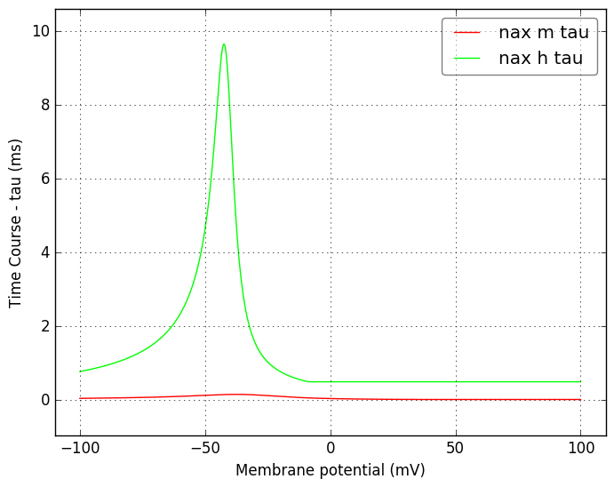</a>
</td>
</tr>
    <tr>
<td width="120px">
            <b>nax__sh0</b> 
            <a href="../nax__sh0.channel.nml">nax__sh0.channel.nml</a> 
            <b>Ion: na</b> 
            <i>g = gmax * m3 * h </i> 
            Na channel for axon. Comment from original mod file: Na current for axon. No slow inact. M.Migliore Jul. 1997,
        added sh to account for higher threshold M.Migliore, Apr.2002
</td>
<td>
<a href="nax__sh0.inf.png">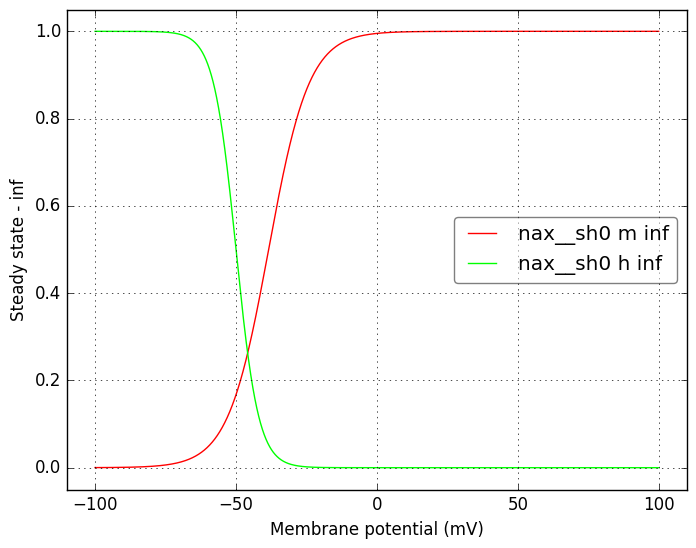</a>
</td>
<td>
<a href="nax__sh0.tau.png">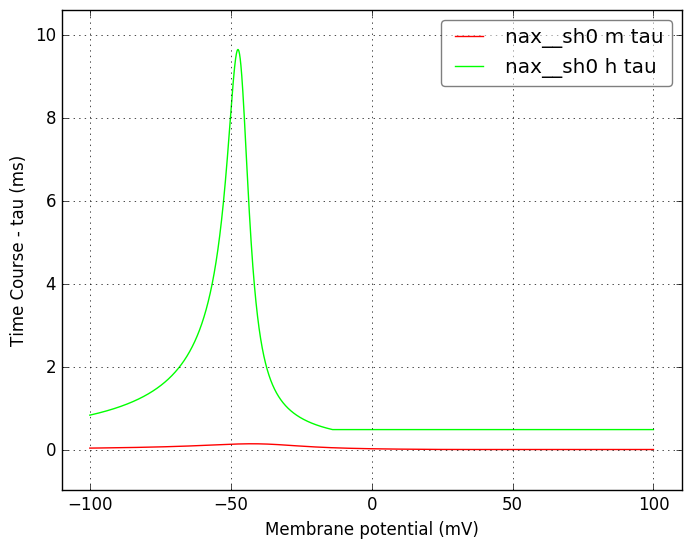</a>
</td>
</tr>
    <tr>
<td width="120px">
            <b>nax__sh10</b> 
            <a href="../nax__sh10.channel.nml">nax__sh10.channel.nml</a> 
            <b>Ion: na</b> 
            <i>g = gmax * m3 * h </i> 
            Na channel for axon. Comment from original mod file: Na current for axon. No slow inact. M.Migliore Jul. 1997,
        added sh to account for higher threshold M.Migliore, Apr.2002
</td>
<td>
<a href="nax__sh10.inf.png">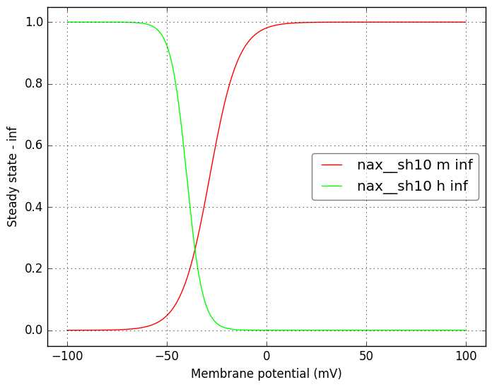</a>
</td>
<td>
<a href="nax__sh10.tau.png">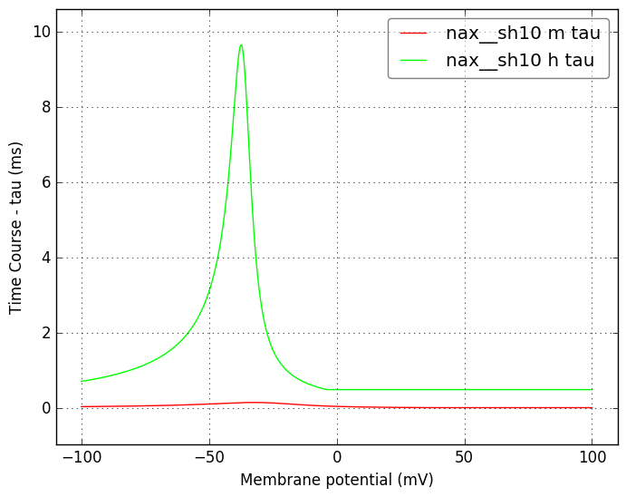</a>
</td>
</tr>
    <tr>
<td width="120px">
            <b>nax__sh15</b> 
            <a href="../nax__sh15.channel.nml">nax__sh15.channel.nml</a> 
            <b>Ion: na</b> 
            <i>g = gmax * m3 * h </i> 
            Na channel for axon. Comment from original mod file: Na current for axon. No slow inact. M.Migliore Jul. 1997,
        added sh to account for higher threshold M.Migliore, Apr.2002
</td>
<td>
<a href="nax__sh15.inf.png">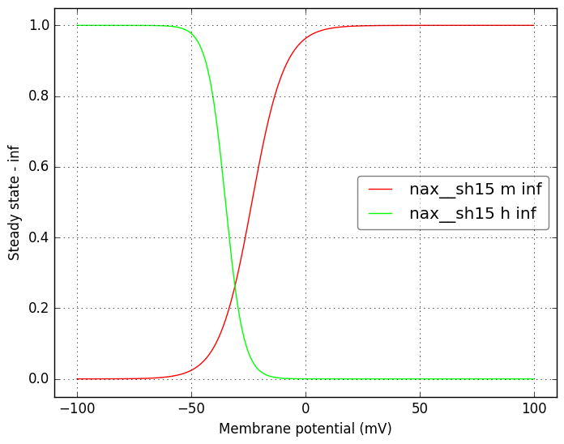</a>
</td>
<td>
<a href="nax__sh15.tau.png">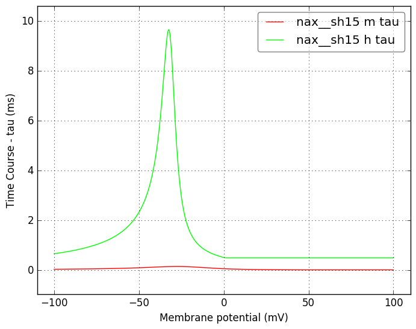</a>
</td>
</tr>
    <tr>
<td width="120px">
            <b>kamt</b> 
            <a href="../kamt.channel.nml">kamt.channel.nml</a> 
            <b>Ion: k</b> 
            <i>g = gmax * m * h </i> 
            A-type K channel. Comment from the original mod file: K-A current for Mitral Cells from Wang et al (1996)
        M.Migliore Jan. 2002
</td>
<td>
<a href="kamt.inf.png">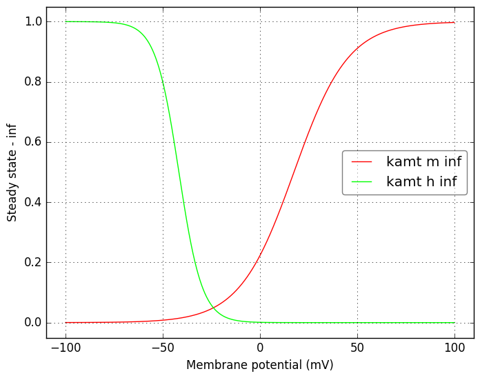</a>
</td>
<td>
<a href="kamt.tau.png">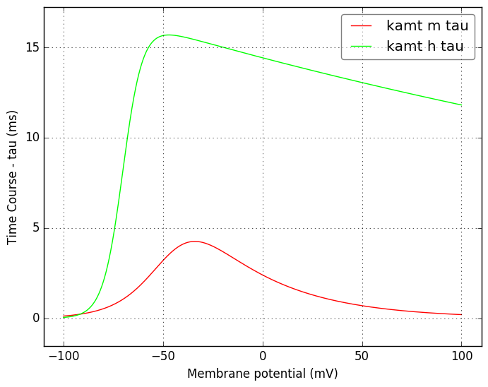</a>
</td>
</tr>
    <tr>
<td width="120px">
            <b>kdrmt</b> 
            <a href="../kdrmt.channel.nml">kdrmt.channel.nml</a> 
            <b>Ion: k</b> 
            <i>g = gmax * m </i> 
            Delayed rectifier K conductance from Mitral cell model. Comment from original mod file implementation:
        K-DR current for Mitral Cells from Wang et al (1996)
        M.Migliore Jan. 2002
</td>
<td>
<a href="kdrmt.inf.png">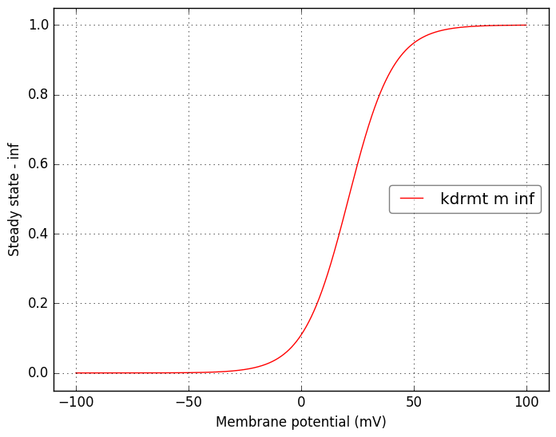</a>
</td>
<td>
<a href="kdrmt.tau.png">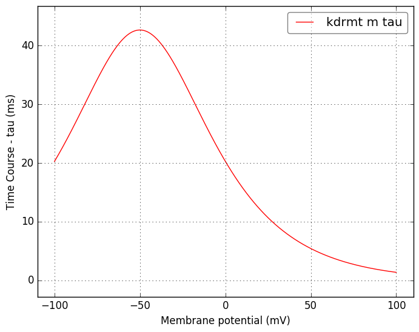</a>
</td>
</tr>
</table>

