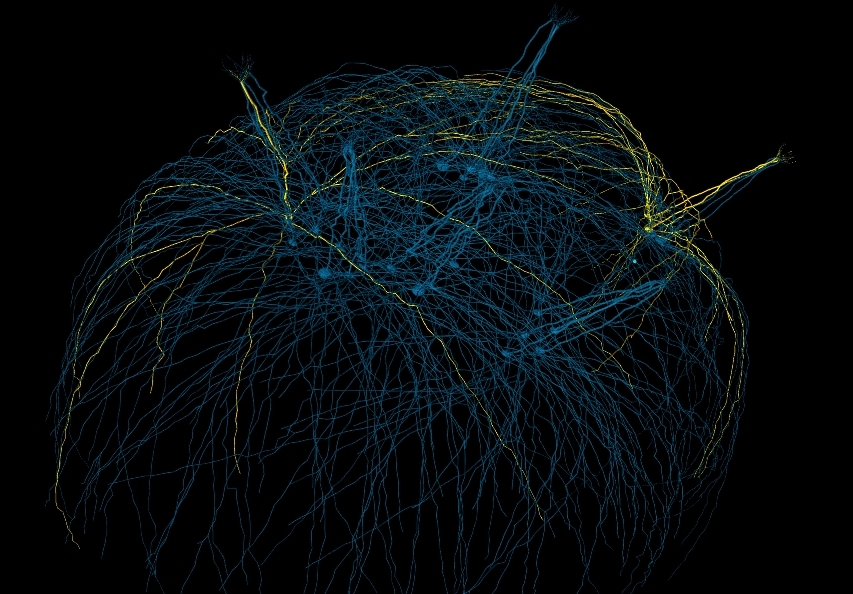
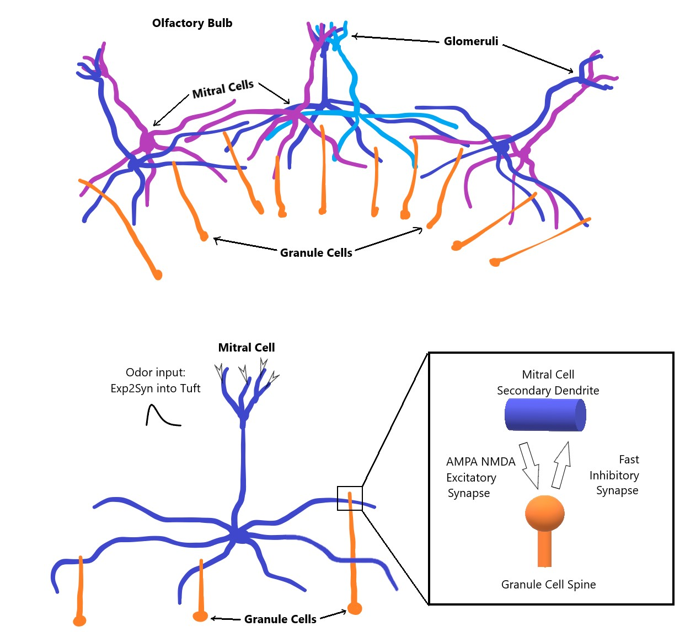

TODO: Replace JustasB urls once merged to OSB

# Migliore et al. (2014) 3D Model of the Olfactory Bulb
This repository hosts the [NeuroML conversion](NeuroML2) of the [Migliore et. al. (2014)](http://journal.frontiersin.org/article/10.3389/fncom.2014.00050/abstract) model of the olfactory bulb. The original NEURON model has 125 glomeruli, 625 Mitral cells (MCs), and ~125,000 Granule cells (GCs). This project converted the original model channels, cells, synapses, network connectivity, and odor input into NeuroML format. Each converted component has been individually validated by comparing their responses to the original versions. The conversion error of the channels and synapses is <1%, while cell and network conversion error is <5% (see Validation below). Scaled down network model (5 MCs) is hosted in this repository, while larger versions can be obtained via the export scripts (see Exporting below). [Click here to view an interactive visualization of a 5 Mitral and 10 Granule Cell Network](http://www.opensourcebrain.org/projects/miglioreetal14_olfactorybulb3d?explorer=https%3A%2F%2Fraw.githubusercontent.com%2FJustasB%2FMiglioreEtAl14_OlfactoryBulb3D%2Fmaster%2FNeuroML2%2FNetworks%2FBulb_5MC_10GC.net.nml)

Original Model: Migliore M, Cavarretta F, Hines ML, Shepherd GM (2014) Distributed organization of a brain microcircuit analysed by three-dimensional modeling: the olfactory bulb [Front. Comput. Neurosci.](http://journal.frontiersin.org/article/10.3389/fncom.2014.00050/abstract) 8:50, obtained from [ModelDB](http://senselab.med.yale.edu/ModelDB/ShowModel.cshtml?model=151681).

 
3D rendering of the converted network consisting of 30 Mitral cells

## Overview
 
Stimulation of a single Mitral cell and the response of its Granule cells

## Model Structure

### Network
The original model depicts a small patch of the mammalian olfactory bulb, consisting of 125 glomeruli with 5 MCs each. Each MC is connected to several hundred GCs via dendro-dendritic synapses. Each GC connects to one MC. MCs are not connected to each other. Scaled down, NeuroML versions of the original model can be found in the [NeuroML2/Networks](NeuroML2/Networks) folder.

### Cells and Channels
Each **Mitral** cell has realistic morphology generated from statistical morphology distributions of reconstructed mammalian MCs. Each MC has a set of tufted dendrites originating in a glomerulus. The tufted dendrites are connected to a primary dendrite which descends down to a soma. From the soma, a set of branching secondary dendrites extend laterally and follow the ellipsoid surface of the olfactory bulb. MC axons are not included in the model. Mitral cells use Each MC has a set of **Granule** cells attached to its lateral, secondary dendrites. Granule cells have simple morphology consisting of a soma, a long primary dendrite, and a small spine which synapses with the parent MC secondary dendrite. GC morphology differs only by the length of the primary dendrite and the location of the spine. Both cell types use Hodgkin-Huxley-like nax, kdrmt, kamt, and passive current ion channels. 

The converted MCs can be found in the [NeuroML2/MitralCells folder](NeuroML2/MitralCells/Exported) while converted GCs can be found in the [NeuroML2/GranuleCells folder](NeuroML2/GranuleCells/Exported). NeuroML versions of the channels can be found in the [NeuroML2/Channels folder](NeuroML2/Channels).

### Synapses
Mitral and Granule cells are connected via dendro-dendritic synapses. Segments of the MC secondary dendrites connect to spines located on GC primary dendrites via the AMPA-NMDA excitatory synapses. A connection in the reverse direction from GC spines onto the MC secondary dendrites is formed by the Fast Inhibitory synapses. Both synapses implement spike-timing dependent plasticity, which strengthens the synaptic weights when incoming spikes have short inter-spike intervals, and weakens the weights when the intervals are long. The converted synapses can be found in the [NeuroML2/Synapses](NeuroML2/Synapses) folder. Networks that implement the above connectivity can be found under [NeuroML2/Networks](NeuroML2/Networks). The connectivity can be visualized via the [OSB Explorer](http://www.opensourcebrain.org/projects/miglioreetal14_olfactorybulb3d?explorer=https%3A%2F%2Fraw.githubusercontent.com%2FJustasB%2FMiglioreEtAl14_OlfactoryBulb3D%2Fmaster%2FNeuroML2%2FNetworks%2FBulb_5MC_10GC.net.nml).

### Input
Network input is provided by stimulation of MC glomerular tufted dendrites via double exponential synapses with peak current values taken from optical imaging odor maps of a mammalian olfactory bulb. The synapses have relatively long rise and fall time constants (50 and 200 ms respectively). Networks that implement the "Mint" odor of the original model can be found in the [NeuroML2/Networks folder](NeuroML2/Networks). Files in the folder that end with "OdorIn.net.nml" implement odor stimulation, while other network files implement un-stimulated networks.
 
## Conversion Validation 
 
### Automated Comparison Suite
The NeuroML model was validated by comparing the output of the converted model to the output of the original model in response to identical stimulation protocols. Original and NeuroML channels were subjected to a voltage clamp protocol, cells were subjected to a current clamp protocol, synapses were subjected to a series of synapse-triggering network events, and networks were subjected to current injections into MC tufts. Networks that included odor input did not include any additional inputs. The results of the comparison tests are in the [/tests/report.html file](https://rawgit.com/JustasB/MiglioreEtAl14_OlfactoryBulb3D/master/tests/report.html).

Code implementing these protocols can be found under the /test folder. Specifically, see protocols for: [Channels](tests/channels/NEURONChannelTest.py), [Cells](tests/cells/NEURONCellTest.py), [Synapses](tests/synapses/NEURONSynapseTest.py), [Networks](tests/networks/NEURONNetworkTest.py)

A script that will perform the comparison tests for all model sub-components and networks can be found in /tests folder, and can be executed with the following command: `python runsuite.py`

Conversion error is a percent difference between the original and NeuroML output waveforms. Computed by sub-sampling the output waveforms to 1/ms and computing a point-by-point mean absolute difference between the original and converted waveforms. Percentage is the absolute mean divided by the min-max range of the output of the original model times 100. This measure is 0% when the output waveforms are point-by-point identical. The mean of the percentages for each stimulus in a protocol is the conversion error of the model. Because the measure is undefined if the original output values are all the same, stimulation protocols were chosen to show changing model output. The code implementing the error measure is defined in the [compareTraces() method](tests/NEURONTest.py#L42).

In general, the smaller scale components (channels, synapses) have the smallest error. Meanwhile, the errors propagate and become larger in components that utilize the smaller scale components (e.g. cells and networks). No fitting has been performed to reduce the propagated error. Additional reductions in error can be obtained by resolving identified issues (see Issues below).
 
### Automated Unit Tests
This model also implements automated tests that ensure no breaking changes have been inadvertently introduced. They validate NeuroML models against NeuroML schema and verify that the spike times for the sub-models match the expected values. These tests run every time code is checked into this repository. 
 
 The following image, if shows "passing", indicates that these automated tests did not detect any issues with the NeuroML models. 
 

 
## How to Download and Use the Converted Model

### Folder Organization
 - NEURON_FULL: This is the original, unmodified NEURON version of the model, obtained from ModelDB and from personal correspondence with the model authors.
 - NEURON: This is the original model modified to allow exporting arbitrarily scaled-down version of the model (e.g. fewer MCs and GCs), and to allow switching of synaptic and odor inputs. No other modifications have been made to the model. 
 - NeuroML2: The subfolders store the NeuroML versions of the model.
 - Python: Scripts used for exporting original model components to NeuroML.
 - tests: Contains the automated comparison test suite that generates a report indicating the percent error differences between the original and converted models.

### Running a simple model
#### Requirements
 - [git](https://desktop.github.com/)
 - [NEURON simulator](https://www.neuron.yale.edu/neuron/download)
 - [jNeuroML](https://github.com/NeuroML/jNeuroML)
 
#### Steps
 1. Clone this repository in a path that does not contain spaces: `git clone https://github.com/JustasB/MiglioreEtAl14_OlfactoryBulb3D.git`
 2. Change into the cloned folder: `cd MiglioreEtAl14_OlfactoryBulb3D/`
 2. Change into one of the sub-folders of [NeuroML2](NeuroML2) e.g. `cd NeuroML2/Networks`
 2. Tell jNeuroML to run one of the LEMS files that define the simulation to run: e.g. `jnml LEMS_1MC_1GC_Odor.test.xml -neuron -run`
 4. This will run a simple 1MC-1GC model stimulated by odor input. You should see NEURON simulator and plots showing the result

Use the steps above to run other models defined in other LEMS*.xml files.

### Network Visualization
Scaled down networks in this repository can be visualized via the web using the OSB Explorer by clicking on one of the Networks listed under the [OSB Project Models tab](http://www.opensourcebrain.org/projects/miglioreetal14_olfactorybulb3d/models).

The models can be visualized offline by converting the model to NEURON (see steps above) and using the built in ModelView tool.

### Running full comparison suite
#### Requirements
 - The steps below have only been tested on Ubuntu Linux. They may work on Mac OS. Unlikely to work on Windows due to path issues.
 - A simple model from above is able to run
 - [NEURON compiled with Python](https://www.neuron.yale.edu/neuron/download/getstd) (e.g. the following command works `python -c 'from neuron import h, gui'`)
 
#### Steps
  1. Change into tests directory `cd tests`
  2. Run the following python command `python runsuite.py`
  3. The tests listed in runsuite.py should run and a [report showing the original and converted model output](https://rawgit.com/JustasB/MiglioreEtAl14_OlfactoryBulb3D/master/tests/report.html) should open.
  
### Exporting models
NeuroML versions of network models with arbitrary numbers of Mitral and Granule cells (up to the counts in the original model) can be created via the use of the export script.

#### Requirements
- All the above, plus:
- [pyNeuroML](https://github.com/NeuroML/pyNeuroML)

#### Steps
 1. Change to the Python/Export folder: `cd Python/Export`
 2. Run the following command `python -c 'import export_network; export_network.export(MCs = 5, GCsPerMC = 2)'`
 3. This will create a network that includes 5 MCs and 10 GCs (5x2) and uses odor input. The network will be created in /NeuroML2/Networks/ folder.
 4. You can use the other parameters in the table below to customize the export.
 5. To use the network in a simulation, copy and modify one of the LEMS*.xml files in the NeuroML2/Network folder to utilize the newly exported network. Then use the steps to run a simple model above to run the simulation.
 
 | Parameter        | Default | Description                                                                                                              |
|------------------|---------|--------------------------------------------------------------------------------------------------------------------------|
| MCs              | 30      | The number of Mitral cells to include in the network                                                                     |
| GCsPerMC         | 3       | The number of Granule cells to include for each Mitral cell                                                              |
| useOdorInput     | True    | Whether to use odor input into Mitral cell tufts. False generates a network without inputs.                              |
| odorInputMaxTime | 200     | The maximum time of odor network events that trigger the odor synapses. This should be <= your intended simulation time. |
| export_cells     | True    | False will only export the network, but will not export the cells. Saves time if the cells have already been exported.   |
  
  
## Issues
The conversion error of the model can be further reduced by resolving [identified issues](https://github.com/OpenSourceBrain/MiglioreEtAl14_OlfactoryBulb3D/issues). If you find additional problems or issues, please create a Github issue at the [issues page](https://github.com/OpenSourceBrain/MiglioreEtAl14_OlfactoryBulb3D/issues).
